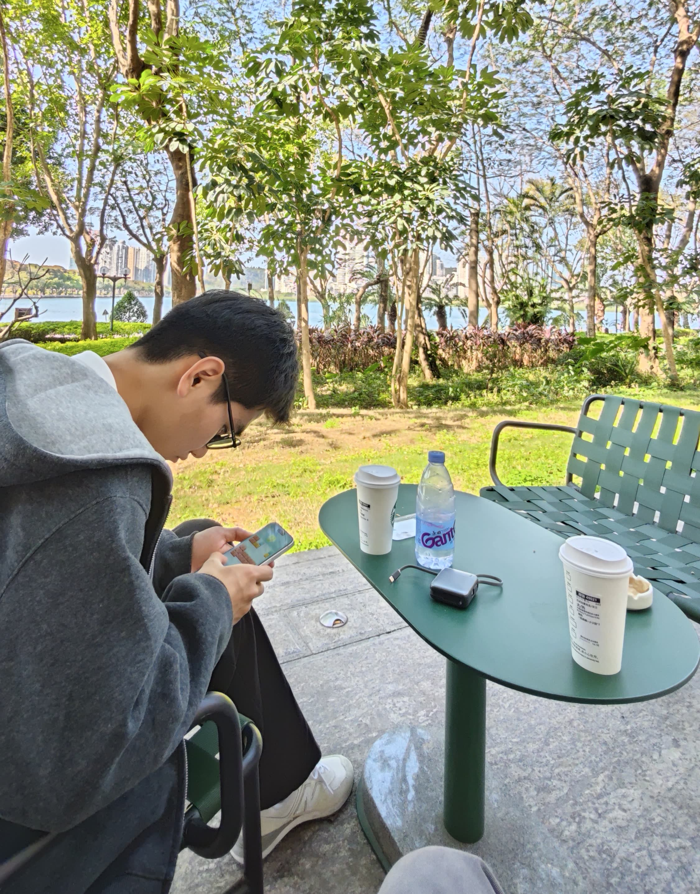

{{}}

李秀成是一名软件开发者，也是一个热爱分享的伙计。这小子在 2021 年开始正式接触编程。他目前没有什么特别拿的出手的成就。

他现在有些迷茫，正在寻找自己的启明星，让我们祝他一切顺利。

受到早期罗永浩的影响，这小子很喜欢把“每个人来到世间都注定要改变世界”挂在嘴边。

如果你想订阅他的博客，可以在 [RSS 阅读器](https://zhuanlan.zhihu.com/p/715661253) 上通过 `https://lixiucheng.com/index.xml` 来订阅他的频道，从而收到他的更新推送。

你也可以在这些平台发现他的踪迹:

- GitHub: [@xiuc](https://github.com/x1uc/)
- Bilibili: [@绣程li](https://space.bilibili.com/359368171)
- Email: [hi@lixiucheng.com](mailto:hi@lixiucheng.com)
