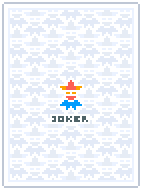
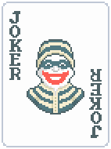

之前听到过同事的一个想法，把「俄罗斯方块」和「杀戮尖塔」结合以来应该会很好玩。我觉得这个点子确实不错，所以这个月玩了下两款非常最火爆的卡牌肉鸽游戏：「杀戮尖塔」和「小丑牌」

第一次玩小丑牌的那天乌云密布，下了非常大的雨，没有比这种天气更适合蜗在房间里玩游戏的了。就这样，我在房间里连续玩了 7 个小时

<!--more-->

结束之后我脑子里只有一个想法：「小丑牌」+「俄罗斯方块」是一个绝妙的点子

## 共识的力量

比起分析分数计算和卡牌构筑这些经常被讨论的内容，我想先说下我发现的一个点：共识的力量。这是推广的关键

1. 玩法载体

   作者选用了德州扑克的牌型作为玩法的载体，德州扑克在全世界都很有知名度，在作者所在的北美更是如此。这让整个游戏的上手门槛非常低的同时非常方便推广

2. 稀缺性共识

   顺子、同花、同花顺、皇家同花顺这种在现实中很难拿到的牌，在游戏中很简单的就可以拿到（有人可能会说稀有度是相对的，但是可以一直拿到同花这样的牌还是很让人高兴）

3. 数字共识

   几十万、上百万的筹码，能够非常直观地传达出「大」的感觉，人们天然会被庞大的数字吸引。我想 Token 消耗量之所以成为全社会都在讨论的话题，也是因为这种数字共识。相比「我昨天用了 13 块钱的 Token」，「我昨天消耗了八千万 Token」听起来显然更加性感

## 卡牌构建

作者提供了 150 张小丑牌，每张小丑牌的功能描述都足够简单（围绕筹码、倍率、经济的简单规则），理解成本很低，这是非常关键的设计

当玩家看到过几十张小丑牌的技能之后，非常简单的就能联想到不同小丑牌之间的联动效果

脑子里出现卡牌联动的想法以及后面构筑卡牌的过程，有时候比卡牌构筑成功之后去收割积分更有快感。生活中大多数的恐惧和美好也都来源与想象，恐惧可能更多一点

同时为了避免玩家路径依赖（找到一种可用的方法之后就一直使用），给出玩家更多探索的可能性，作者也做了对应的设计

1. 降低玩家获取小丑牌的成本

   例如乌合之众（Riff-Raff）这张小丑牌，让玩家可以低成本的去尝试各种不同的小丑牌，去探索更多的构筑可能。

{{}}

1. 为小丑牌添加额外效果

   给小丑牌添加了镭射、负片、多彩等效果，给玩家平常不会使用的牌加上前期无法拒绝的增益效果

因为有的牌单看介绍不能理解全部，必须要拿起来玩一局，所以要强塞给玩家卡牌去让其体验。

拿窃贼（Burglar）这张牌举个例子，光看文字描述的话，我只是认为我要失去所有的弃牌次数去获得一些收益。我想大多数玩家和我一样，出于对损失的厌恶，不会选择捡起这张牌

{{}}

但是玩过一次这张牌就会发现，这张牌的收益挺高的。因为出牌和弃牌都是过牌方式的一种，出牌还能得分，同时额外的出牌次数还能转换为金币。这样看这张牌还不错对吧

## 经济系统

《Balatro》采用了一套类似自走棋的经济系统（未使用的金币可以产出利息）

真正开始分析后，才发现利息机制的重要性。利息让整个经济系统的深度提高了一个等级，让玩家需要根据局势去在即时收益和长远收益做抉择

## 其他

我认为非常不错的地方：

1. 音效与视觉反馈

   这个做的太棒了，让游戏的爽感提升了一个档次。虽然没有玩过移动版，但是我想加上震动反馈，爽感一定会更上一层楼

2. 挑战模式

   提供了几种非常有意思的预设

我认为可以改进的地方：

1. 通关反馈

   现在的无尽模式和闯关模式基本上是无缝衔接的。这让高难度关卡的通关反馈很弱。
