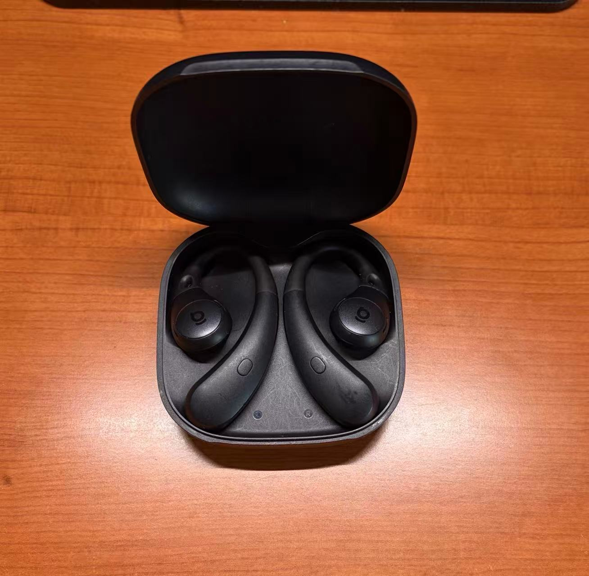
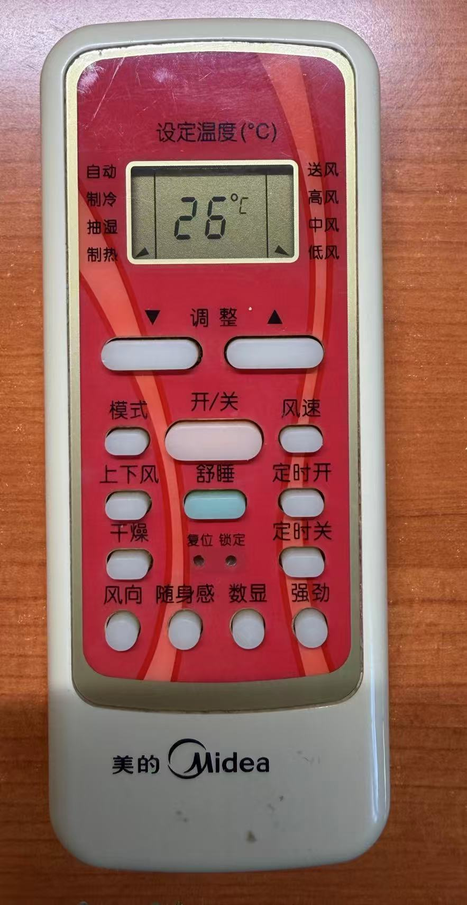
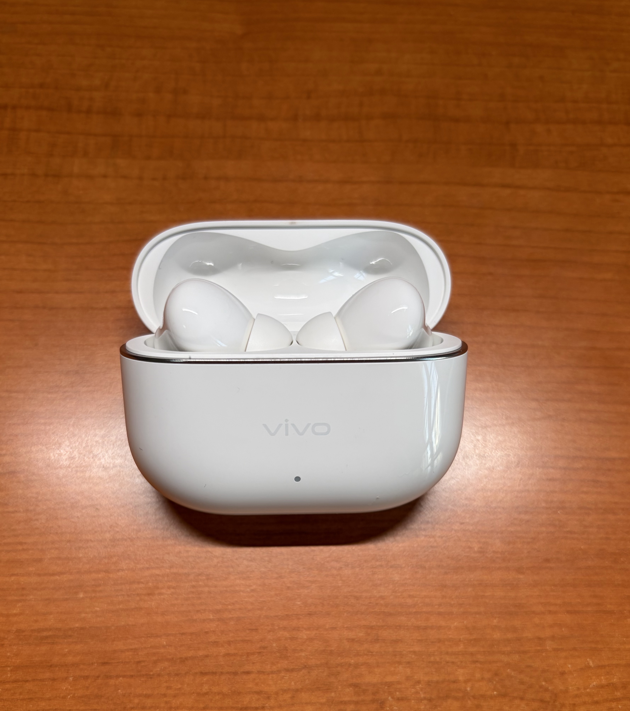
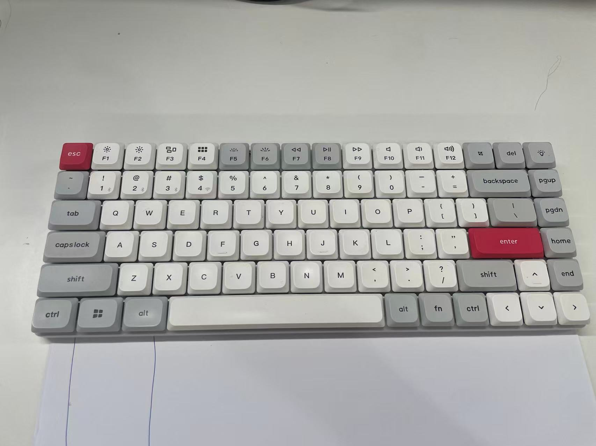
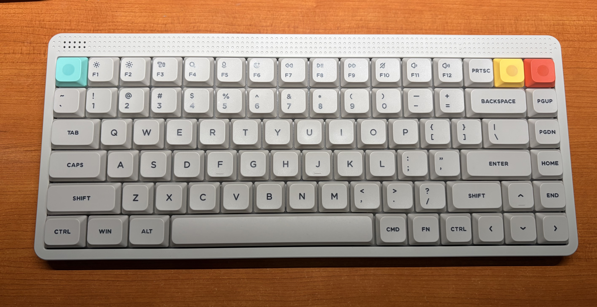
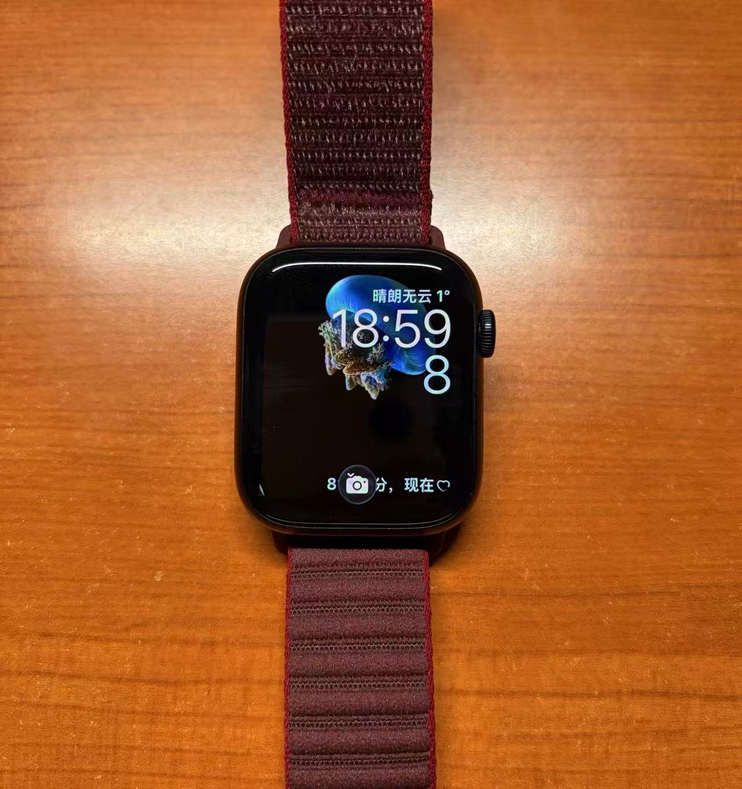

## 过去一年都买了啥

### 倍思BF1 开放式蓝牙耳机 <small style="color:grey">¥150</small>

{{}}

今年到了新环境之后，有一段时间耳朵总是痒，当时我怀疑是我使用的入耳式耳机导致的（事实是过敏性鼻炎），所以我买了这个开放式的蓝牙耳机。我对耳机的需求就是能听清楚声音就足够了，对音质方面没有更多的需求。

**Pros**

- 佩戴基本无感

**Cons**

- 和我一把无线键盘有冲突，如果它俩离得太近键盘会失灵

### Vivo TWS5 <small style="color:grey">¥320</small>

因为现在住在一个比较老的小区，周围租户的空调都已经服役了很久很久了。光看遥控器就能感受到它们的年龄了。

{{}}

{{}}

冬天之后，备受空调低频噪音的困扰。
跟物业沟通&我自己登门去和邻居确认空调问题，进行了一段时间还是没解决问题。所以打算先买个降噪耳机来缓解一下。

选择这款产品的原因是这个是Vivo最好的TWS耳机，我认为这是Vivo用户能买到最好的同品牌耳机，所以Vivo应该会很用心的做。（实际上和同价位其他产品没啥区别

**Pros**

- 降噪优秀，开背景音后，外界声音基本隔断

**Cons**

- 腔体大，佩戴体验一般，尤其是睡觉场景
- 底噪太大

### REMAX 10000mAh自带线充电宝 <small style="color:grey">¥65</small>

旧充电宝给了充电宝被扣在机场的同学，国庆回家的时候需要买一个充电宝。

自带线我认为是很好的解决方案。常规充电宝需要自带一根线，不管多好的设计，加上一根线之后，一切都变得那么凌乱。

最终我选择了一款我认为颜值不错的产品（和其他的相比），但是我现在不想多看它一眼。这个稀烂的做工，经过几次使用之后，数据线没法完全的卡死在凹槽中，自带一条小尾巴。

这个塞进去又自己弹出来的感觉真让人火大。

{{}}

**Cons**

- 做工烂

### 雷柏E9000G 键盘 <small style="color:grey">¥85</small>

我最初是机械键盘的忠实用户。但是因为各种原因，前年（2024，时间过得好快）有一段时间我必须使用笔记本自带的键盘，发现薄膜键盘（剪刀脚）也很好用。

所以我为我的主机也配了一把剪刀脚键盘，[雷柏E9000G](https://rapoo.cn/product/787)

这把键盘算是我买过最糟糕的键盘了，触发压力大，手感涩，[无线连接不稳定](#倍思bf1-开放式蓝牙耳机-small-stylecolorgrey150small)

{{}}
**Cons**

- 无线信号不稳定
- 手感糟糕

### Keychron K3MAX键盘 <small style="color:grey">¥330</small>

这把键盘是我所有见过的键盘中，颜值最高的，真的很喜欢红灰白的过渡撞色设计！键盘布局紧凑、整齐，非常的干练。无下沉式外壳的设计，让整个键盘非常的好清洁。

习惯使用笔记本自带的键盘之后，切换回高轴机械键盘之后，长时间使用键盘之后，手腕经常感觉到很酸。因为这把键盘是矮轴键盘，键盘的前高很低，极大地缓解传统键盘输入时手腕的压力。

有好就有坏，矮轴 + 短键帽 + 无下沉式外壳的设计 + 平板式定位板，让这款键盘的敲击反馈很肉。

{{}}

**Pros**

- 颜值、布局
- 清洁方便
- 前高低，手腕友好

**Cons**

- 敲击反馈肉

### NuPhy Node75 <small style="color:grey">¥340</small>

[耳机](#倍思bf1-开放式蓝牙耳机-small-stylecolorgrey150small)和[键盘](#雷柏e9000g-键盘-small-stylecolorgrey85small)
的无线信号相互干扰让本来体验就不好的键盘体验更糟。所以我决定买一把键盘去替换。

这把键盘也是75紧凑布局。这把键盘和刚才的Keychron在很多地方都是互补的。

键盘有多余的点缀元素，下沉式外壳。

这款键盘键帽的颜色和图片中的颜色有差别，实际看下来是偏暗、厚重的白色。这种白色和左上、右上非常活泼的点缀颜色的搭配我不太喜欢。

敲击反馈还是很不错的。

{{}}

**Pros**

- 敲击反馈强
- 前高低，手腕友好

### 二手瀚铠 RX7600 合金 <small style="color:grey">¥1250</small>

我的主机最开始只打算做服务器使用，所以没有独显，我选择了AMD 5500GT，一颗带核显的CPU，以备不时之需。但是，后来我用它做了我的日常用主机。虽然是核显，但是使用KDE
plasma 桌面4K/120HZ完全无压力，所以我就一直没添加独立显卡。

但是年末的时候，看到游戏《光与影：33号远征队》的故事梗概，对生命&感情的话题我非常感兴趣，打算体验一下。因为使用的是Linux平台，所以就考虑了
Plug & Play 的A卡，最后在闲鱼上淘到了这张 RX 7600。

在Linux平台上使用A卡的体验还是非常舒心的，即插即玩，中间没有遇到过任何的问题，几个月来稳定运行，没出过任何问题。

{{}}

### 8BitDo 猎户座2代 <small style="color:grey">¥220</small>

没错，也是为了玩《光与影：33号远征队》买的（就是为了这碟醋，才包的饺子

不知道为什么国产的手柄厂商这么喜欢把自己那丑到爆的Logo，放大，然后放到手柄的中间。8BitDo这一点做得还算克制，挺不错的。

使用体验和我其他使用过的手柄没有明显区别。但是体验确实很棒，Plug & Play，并且因为有底座的存在，收纳&充电全都不需要考虑，想玩了就拿起来，不想玩就放下，体验非常完美！

{{}}

### 米家智能显示器挂灯1S <small style="color:grey">¥150</small>

因为房间的主灯比较暗，这种明暗的对比导致晚上看显示器的时候眼睛很不舒服。米家的显示器挂灯应该是百元价位的唯一选择了，而且口碑还是很不错的。

买回来之后，体验确实很棒。自从它挂在屏幕上之后，基本没动过，只使用开/关功能，less is more。

[感觉不到它的存在，有时候是对一款产品的最高评价](https://www.bilibili.com/video/BV1Tb411j7pf)。

{{}}

### SANC G7U <small style="color:grey">¥1240</small>

> I distinctly recall the joy I felt when I was 11 years old, and my dad came back from CompUSA and presented me with a box containing one of the largest monitors available, which was probably a 17" CRT. “Given the amount of time you’ll spend looking at your monitor,” he explained, “we might as well invest in a good one.” For context, both of my parents are programmers, and from a young age, I spent most of my free time at a computer.
>
> Ever since then, I’ve used my dad’s logic to justify buying premium monitors, and it’s served me well. I’m at my computer for 2500 hours per year. On a per-hour basis, the cost of a high-end monitor is basically nil.
>
> — _[Building my new development desktop](https://mtlynch.io/retrospectives/2024/12/#building-my-new-development-desktop)_

因为最开始打算买Mac Mini（软件生态 + 类Unix终端），所以选了一块4K的屏幕。后面发现我的主机搭配上KDE Plasma桌面环境的使用效果很优秀。5500GT的核显就能保证日常4K/120HZ的需求，原生Linux的开发体验也非常棒。

没体验过特别好/差的屏幕，所以我也没法评价，但是这一段时间使用下来，没有遇到任何的问题，4K的清晰度是真的高。

### Apple Watch Series 9 <small style="color:grey">¥1900</small>

人们很喜欢看数据的量化结果。智能穿戴设备把睡眠数据、运动数据、日常生活数据...进行量化，这是个绝妙的点子。

Apple Watch的使用体验还是很不错的，尤其是数据可视化这方面。在数据测量方面，我感觉数据的精准度也是挺不错的。

但是Apple Watch附带的硅胶表带的佩戴体验真的糟糕，到达了影响睡眠的程度。换成针织表带之后，佩戴体验好了非常多，有时候我都感觉不到我戴了没。

另外就是充电，一天一充的强度确实是有点高，忘记充了就没法用。

{{}}

### 树莓派4B <small style="color:grey">¥350</small>

很久之前，看到[mtlynch](https://mtlynch.io/)
的[TinyPilot](https://github.com/tiny-pilot/tinypilot)项目感觉很有意思，[它可以让你使用浏览器远程操作服务器，使用体验就像你坐在它面前一样](/translations/tinypilot)

使用场景是：你的服务器和工作室并不在一个房间，当服务器崩溃时，你不得不把服务器拖到工作室，插上各种线材，解决问题之后，又需要把服务器拖回它的位置，再插上各种线材。

我不确定在中国这种需求是不是旺盛，如果你有这方面的需求，欢迎[联系我](mailto://hi@lixiucheng.com)寻求帮助。

（2026/02/08，树莓派4B 4G的价格为¥570



## Summary

**最超值**：[米家智能显示器挂灯1S](#米家智能显示器挂灯1s-small-stylecolorgrey150small)

**体验最好**：[8BitDo 猎户座2代](#8bitdo-猎户座2代-small-stylecolorgrey220small)

**最好看**： [Keychron K3MAX](#keychron-k3max键盘-small-stylecolorgrey330small)

**最糟糕**：[REMAX 10000mAh自带线充电宝](#remax-10000mah自带线充电宝-small-stylecolorgrey65small)
