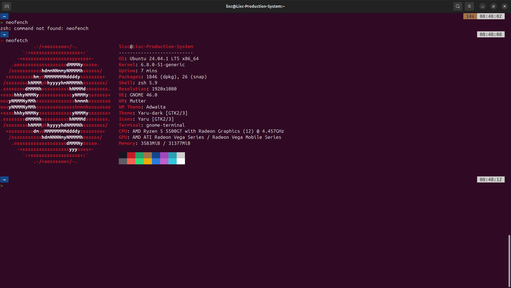
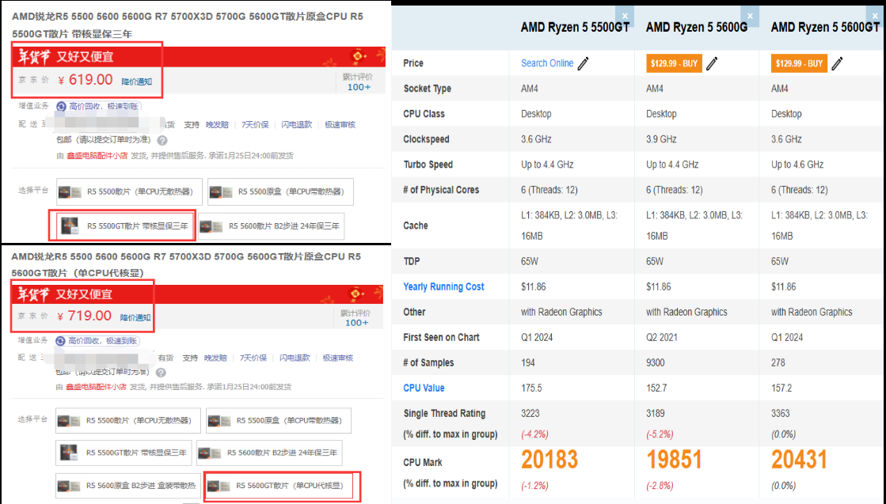
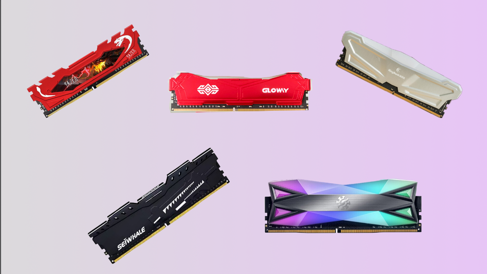
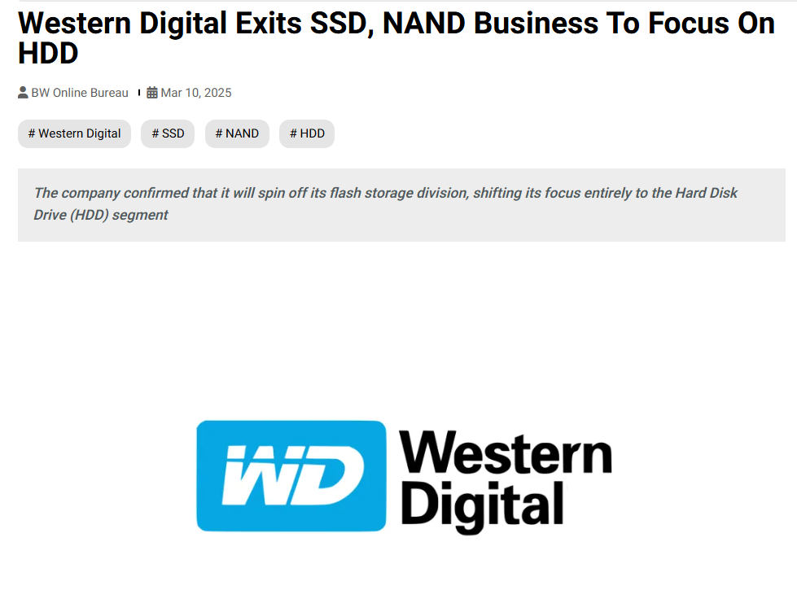
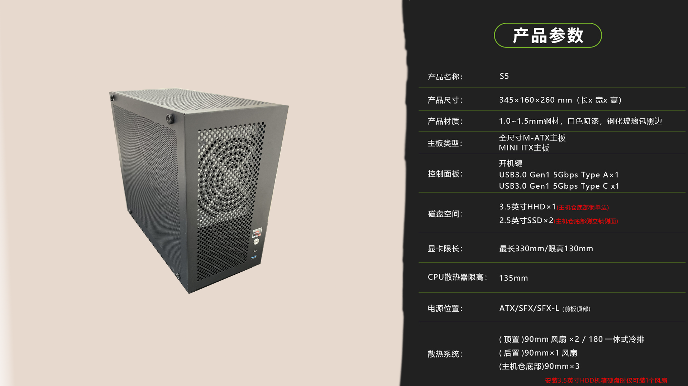

{{}}

## Background

- 内存紧张
- 类Unix开发环境

目前我手中的开发主力设备是我刚上大学时买的[笔记本](https://www.acer.com/hk-zh/laptops/swift/swift-x-amd)，这台电脑一直很给力，兼顾了轻薄和性能。

缺点是内存是板载的，不支持扩展。可以说内存紧张是让我组新机的最重要的推手。另外就是Windows的命令行平台我不太习惯，只要能在WSL上运行的工作，我都尽量使用WSL。

在Linux上开发确实有很多事都会变得非常省心，给我一种一切行为都在我掌控范围内的感觉。而Windows给我的感觉像是一个黑盒，一切都依赖于鼠标的Click。

## 配件选择

因为这是我第一次装机，为了避免意外，所有的配件我都挑选了全新的。

### CPU

我算是一个AMD的“老”用户了。大约十年前，我用上了我姐淘汰下的的笔记本电脑，那台电脑搭载的就是AMD的CPU。 性能可以说是非常的垃圾，运行LOL大概是电竞水平---3帧。

{{}}

但是当我上大学的时候，AMD已经凭借Zen架构彻底翻身了，我大胆的选择了AMD，也是没有让我失望，使用体验很棒

所以这次我依旧选择AMD的CPU，我选择的是R5 5500GT 。 一颗兼具性价比和性能的CPU。

我买的是盒装的CPU。 所以这一颗CPU就解决了三个硬件：CPU 、 显卡 、 散热器。

### 主板

对于我的预算，主板就在A520和B450之间选择。两者的差距主要是是否支持超频。对于AM4插槽的主板，微星B450迫击炮是一款明星产品，但是考虑到全新的B450基本买不到，并且考虑到我也没有进行超频的需求，最后我选择了华硕 Prime A520M-K。

唯一的不满意是主板只支持2条内存，并且最大内存仅为64GB。

### 内存

{{}}
内存没什么好说的，Crucial DDR4 3200MHZ 16G X 2 ，镁光是存储方面的大厂，质量应该没什么好说的。
3200MHZ 的频率应对开发任务也是绰绰有余了。另外想吐槽一下，有些内存的马甲也太沙马特了吧！！

### 硬盘

{{}}

最开始我是打算购买长江存储的致钛Ti5000Plus，但是价格确实有点小贵，而且很多用户反映有掉盘的问题。

也有很多人推荐RC20 和 SD10 这两块盘。 但是最终我选择了西部数据SN580。 因为SN580是无缓的硬盘，温度控制相对好一点。

就在我买完这块硬盘的不久，西数宣布推出固态市场。......虽然对我没什么影响，但是也挺戏剧性的，233

### 网卡

无线的使用场景还是比较丰富的，所以我买了一个Intel A210网卡，使用PCIE \* 1 的接口。确实挺方便的，Ubuntu24.04自带的这个网卡的驱动，插上去之后，直接就可以使用了。 非常方便

### 电源

低功率电源没有什么大厂的，口碑特别好的产品。我选择了一款网红产品，玄武400Kill。 目前使用起来不错，没有遇到任何问题。就是这款电源的供电接口异常难插！！！他们官方的描述是他们在”方便插入“和“用户安全”的抉择中选择了“用户安全”。

### 机箱

鱼巢 S5-MAX 是一款 M-ATX 机箱，加 20 元将亚克力侧板换成了密孔铁板。因官网暂无 S5-MAX 参数，以下采用 S5 的参数，两者侧面面积接近。

{{}}

### 第一次装机经验总结

- 大力出奇迹：内存条和电源线比想象中难插，不要怕用力，插到底才行。
- 注意供电接口：显卡（6+2）和 CPU（4+4）都是 8pin，外形相似，千万别插错，否则可能烧板。

## 配件清单及价格

| 配件 | 名称                   | 价格(￥) |
| ---- | ---------------------- | -------- |
| CPU  | R5 5500GT 盒装         | 611.80   |
| 电源 | 玄武400kill            | 98.92    |
| 内存 | Crucial DDR4 16GB \* 2 | 277.88   |
| 硬盘 | 西数 SN580 1TB         | 368.80   |
| 主板 | 华硕 A520 M-K          | 343.00   |
| 网卡 | A210 PCIE              | 76.00    |
| 硅脂 | 利民TF7                | 6.35     |
| 机箱 | 鱼巢 S5 MAX + 密孔板   | 86.92    |
| 合计 |                        | 1869.67  |
