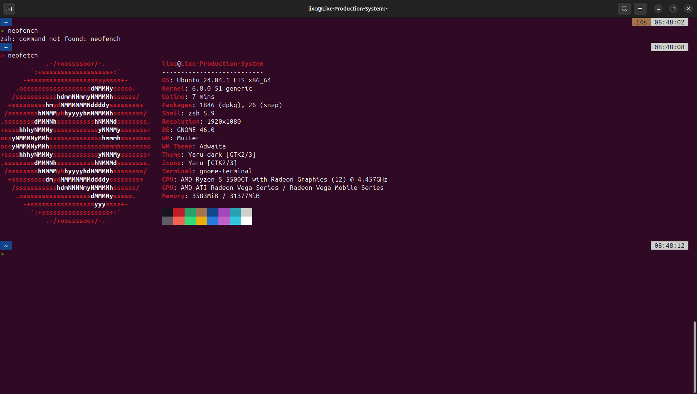
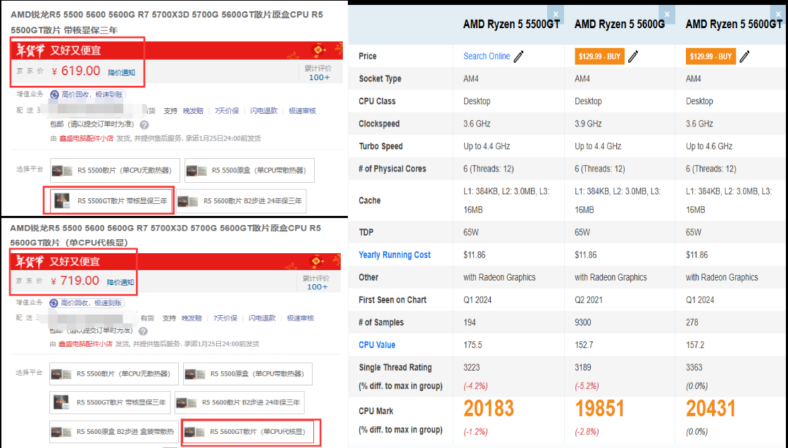
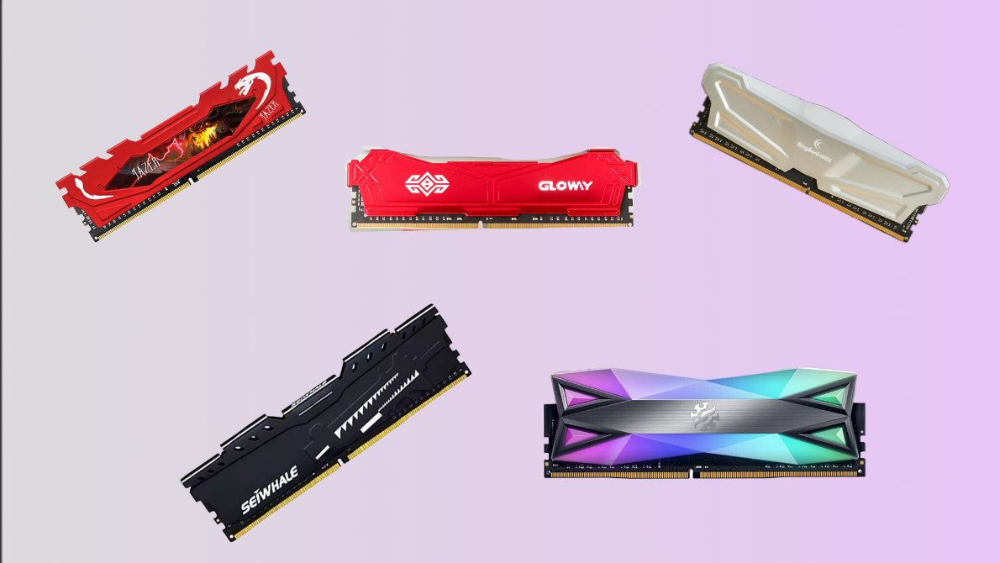
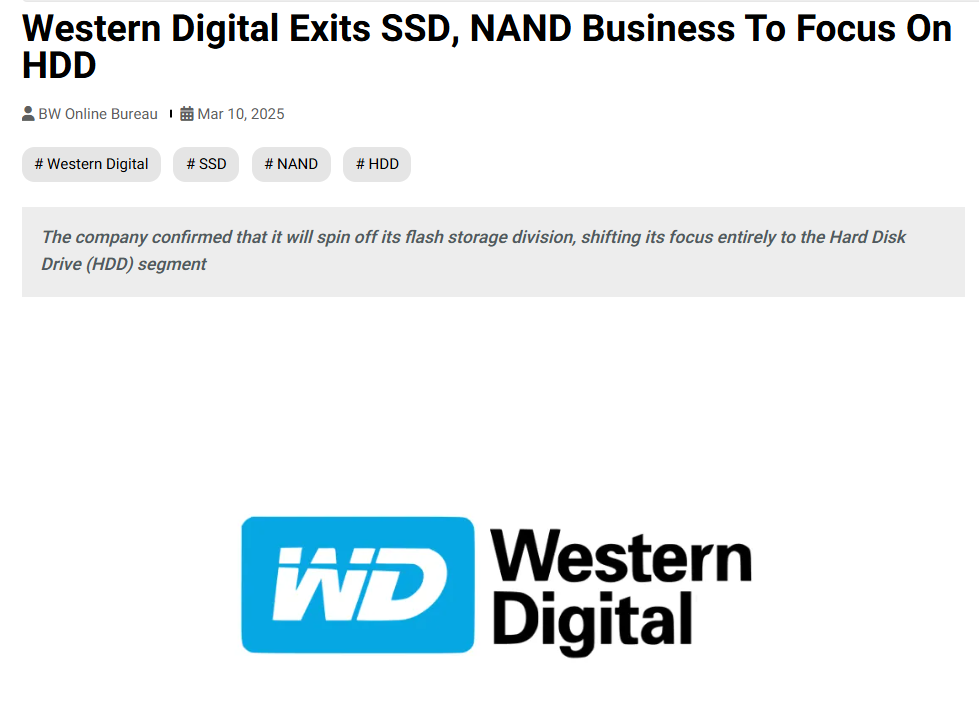
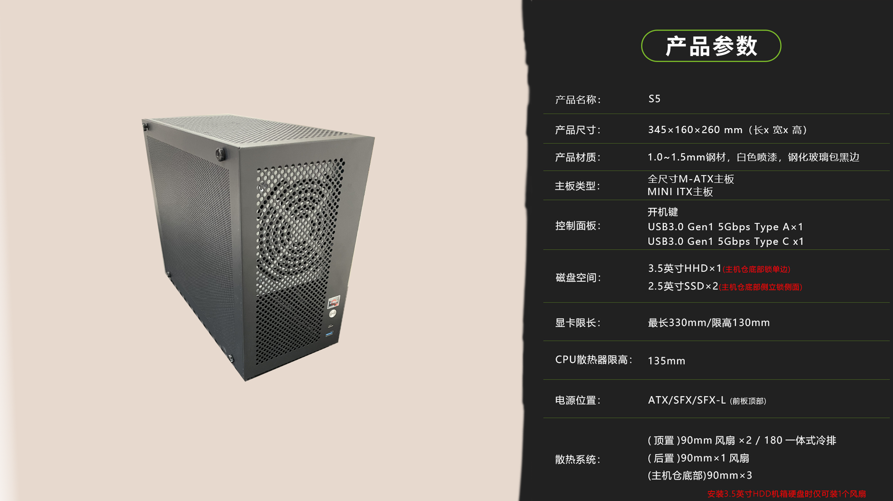
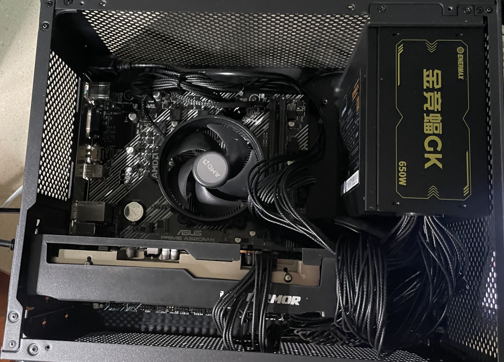
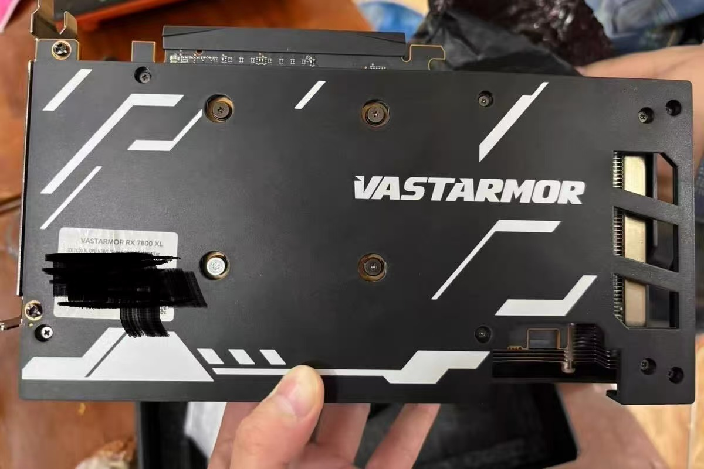

{{}}

## Background

- 内存紧张
- 类 Unix 开发环境

目前我手中的开发主力设备是我刚上大学时买的[笔记本](https://www.acer.com/hk-zh/laptops/swift/swift-x-amd)，这台电脑一直很给力，兼顾了轻薄和性能。

缺点是内存是板载的，不支持扩展。可以说内存紧张是让我组新机的最重要的推手。另外就是 Windows 的命令行平台我不太习惯，只要能在 WSL 上运行的工作，我都尽量使用 WSL。

在 Linux 上开发确实有很多事都会变得非常省心，给我一种一切行为都在我掌控范围内的感觉。而 Windows 给我的感觉像是一个黑盒，一切都依赖于鼠标点击。

## 配件选择

因为这是我第一次装机，为了避免意外，所有的配件我都挑选了全新的。

### CPU

我算是一个 AMD 的“老”用户了。大约十年前，我用上了我姐淘汰下的笔记本电脑，那台电脑搭载的就是 AMD 的 CPU。性能可以说非常垃圾，运行 LOL 大概是电竞水平，3 帧。

{{}}

但是当我上大学的时候，AMD 已经凭借 Zen 架构彻底翻身了，我大胆地选择了 AMD，也没有让我失望，使用体验很棒。

所以这次我依旧选择 AMD 的 CPU，我选择的是 R5 5500GT。一颗兼具性价比和性能的 CPU。

我买的是盒装的 CPU。所以这一颗 CPU 就解决了三个硬件：CPU、显卡、散热器。

### 主板

对于我的预算，主板就在 A520 和 B450 之间选择。两者的差距主要是是否支持超频。对于 AM4 插槽的主板，微星 B450 迫击炮是一款明星产品，但是考虑到全新的 B450 基本买不到，并且考虑到我也没有进行超频的需求，最后我选择了华硕 Prime A520M-K。

唯一的不满意是主板只支持 2 条内存，并且最大内存仅为 64GB。

### 内存

{{}}
内存没什么好说的，Crucial DDR4 3200MHz 16G x 2，镁光是存储方面的大厂，质量应该没什么好说的。
3200MHz 的频率应对开发任务也是绰绰有余了。另外想吐槽一下，有些内存的马甲也太沙马特了吧！

(EDIT: 2025-12-03，[美光宣布退出消费者业务](https://investors.micron.com/news-releases/news-release-details/micron-announces-exit-crucial-consumer-business)。)

### 硬盘

{{}}

最开始我是打算购买长江存储的致钛 Ti5000Plus，但是价格确实有点小贵，而且很多用户反映有掉盘的问题。

也有很多人推荐 RC20 和 SD10 这两块盘。但是最终我选择了西部数据 SN580。因为 SN580 是无缓的硬盘，温度控制相对好一点。

(EDIT: 2025-02-24，就在我买完这块硬盘的不久，[西数宣布完成闪存业务的拆分](https://www.westerndigital.com/company/newsroom/press-releases/2025/2025-02-24-western-digital-completes-planned-company-separation)。)

### 网卡

无线的使用场景还是比较丰富的，所以我买了一个 Intel A210 网卡，使用 PCIe x1 的接口。确实挺方便的，Ubuntu 24.04 自带这个网卡的驱动，插上去之后直接就可以使用了，非常方便。

### 电源

低功率电源没有什么大厂、口碑特别好的产品。我选择了一款网红产品，玄武 400Kill。目前使用起来不错，没有遇到任何问题。就是这款电源的供电接口异常难插！他们官方的描述是他们在“方便插入”和“用户安全”的抉择中选择了“用户安全”。

### 机箱

鱼巢 S5-MAX 是一款 M-ATX 机箱，加 20 元将亚克力侧板换成了密孔铁板。因官网暂无 S5-MAX 参数，以下采用 S5 的参数，两者侧面面积接近。

{{}}

### 第一次装机经验总结

- 大力出奇迹：内存条和电源线比想象中难插，不要怕用力，插到底才行。
- 注意供电接口：显卡（6+2）和 CPU（4+4）都是 8pin，外形相似，千万别插错，否则可能烧板。

### 配件更新


**更新时间 2026-02-23**


#### 电源

没错，我装机的时候就把显卡和 CPU 的供电弄反了，上电之后供电接口就冒烟了，万幸的是主板没有受到影响，一切还能够正常使用。

但是当我想要为我的主机添加显卡的时候，我还是有点担心电源的显卡接口是否有问题，为了避免不必要的麻烦，索性买了新的电源：**金竞蝠 GK650**。

电源现在使用了几个月了，没什么大问题，就是这款电源的噪音有点大。

{{}}

#### 显卡

现在这台主机作为我的桌面电脑使用，为了满足游玩游戏的需求，同时考虑到现在内存价格飞涨的因素，所以我装配了一张显卡，**瀚铠 RX7600 合金**。

A 卡在 Linux 平台（Fedora 42 + KDE Plasma 6.5.4）上的使用体验是非常好的，即插即用，目前还没有出现过任何问题。

{{}}

## 配件清单及价格

| 配件 | 名称                   | 价格(￥) |
| ---- | ---------------------- | -------- |
| CPU  | R5 5500GT 盒装         | 611.80   |
| 电源 | 金竞蝠GK650            | 246.80   |
| 内存 | Crucial DDR4 16GB \* 2 | 277.88   |
| 显卡 | 瀚铠 RX7600 合金       | 1258.00  |
| 硬盘 | 西数 SN580 1TB         | 368.80   |
| 主板 | 华硕 A520M-K           | 343.00   |
| 网卡 | A210 PCIe              | 76.00    |
| 硅脂 | 利民TF7                | 6.35     |
| 机箱 | 鱼巢 S5 MAX + 密孔板   | 86.92    |
| 合计 |                        | 3275.55  |
