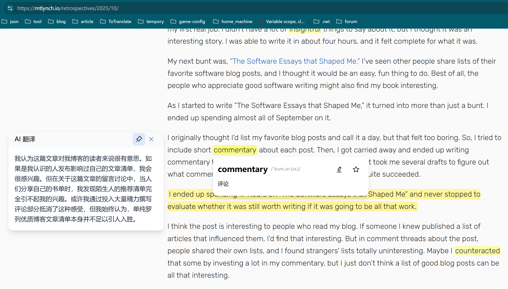
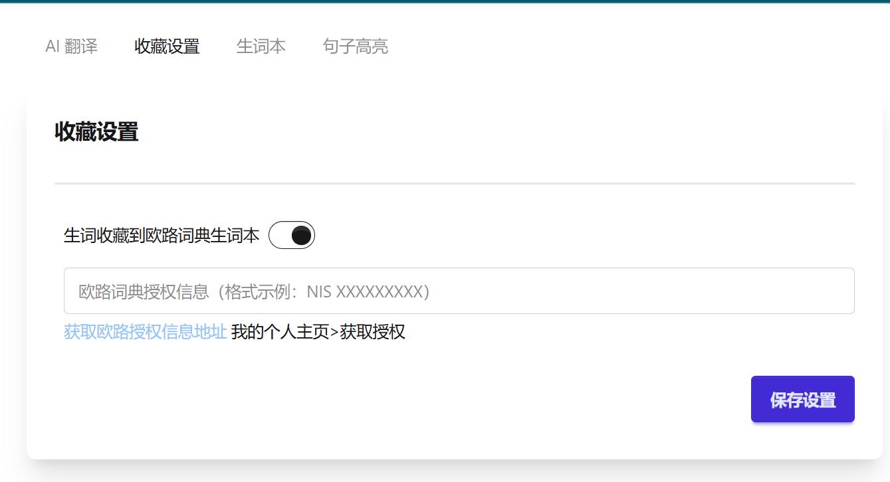
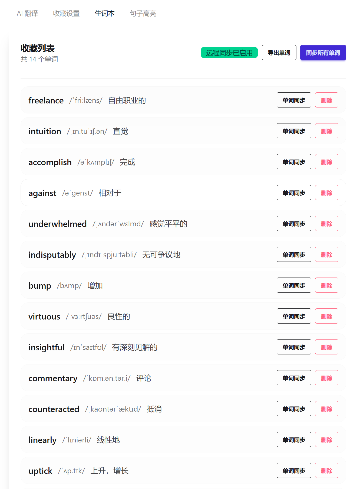
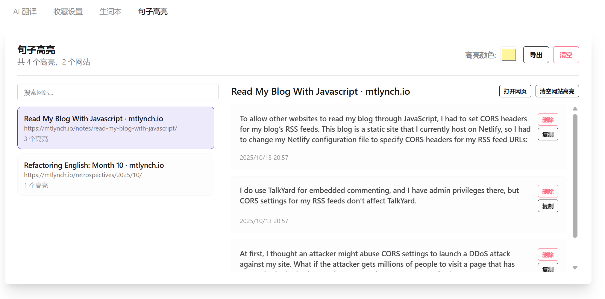

{{}}

写这篇文章只是分享记录，我的英语水平目前还很糟糕。

## 随想

在学生时代的大部分时候，我认为英语学习是没有用的。当时的我十分认同网上关于英语学习的观点。

> 我又不出国，学英语干嘛？
> 为什么我们非得学别人的语言？
> 死记硬背的东西，没意思。

而且同学们对数学好，英语差的人有天生的崇拜，常常会为这类人贴上“高智商”的标签。这些高智商的同学常又为了保持自己的天才光环从而更加的去贬低英语这门学科，为自己不学习英语提供理由。

大学之前，我使用互联网基本上只是使用App提供的服务。上了大学之后，使用互联网的场景更多是检索信息。英语凭借着使用人数多、内容没有严格的审查等优势，成为了毫无疑问的互联网中承载信息最多且质量上乘的语言。全世界都在说英国话，[牛爵爷](https://en.wikipedia.org/wiki/Isaac_Newton)的话越来越国际化。

我开始自驱的学英语有三个原因：

- 因为英语是互联网中承载信息最多的语言，所以如果你想获取有用的信息，那么英语这个工具是必不可少的。
- 我是一个特别喜欢聊天的人，喜欢听各种各样的人分享他们各式各样的经历，学会英语之后，就可以和时间上任何地方的人交流，分享各自在不同环境下成长时所遇到的遭遇。太美妙了！
- 不同的语言伴随着不同的思考方式，我想体验一下英语的思考方式。

## for-simple-read 开发背景

在我自驱动学英语之后，我给自己布置了一个任务：每天读一篇英语文章。

我的流程是：复制HTML网页文字到编辑器（Obsidian） ➡️ 在编辑器上对原文进行操作

读文章的时候我有三个常用的操作

- 高亮：（Ctrl + H） 快捷键
- 查词：（Alt + 1）快捷键呼出有道查词面板
- 翻译： 切换到Chrome，丢给ChatGPT翻译

使用了一段时间后我发现了几个问题

- 复制是人工操作 & 有时涉及格式转换（最重要）
- 查词和翻译操作都需要切换上下文，不方便
- 所有记录都由手动管理（生词记录、高亮语句记录）

所以我就打算制作一款浏览器插件，让这些操作都可以在网页端直接进行。

## for-simple-read 功能介绍

### 查词

查词由三个部分组成

- 生词查询（会将生词和上下文交给AI，确保生成准确的生词翻译）
- 生词高亮（对单词加入高亮，并且缓存查询结果，下次点击高亮时直接使用缓存结果，提高查询速度）
- 生词收藏 (当前支持欧路词典生词收藏，并且会附带收藏单词语境的上下文到欧路词典，方便记忆)
  

### 翻译

在阅读的过程中，常常需要一个小窗，固定在一个地方提供翻译服务。



### 高亮文本

读文章的时候，总有一些特别好的句子需要特别记录。
所以我做了高亮文本的功能。并且除了在页面突出展示之外，在管理页面还可以看到每篇文章的高亮记录，方便回顾。


### 配置页

{{}}

{{}}

{{}}

{{}}
