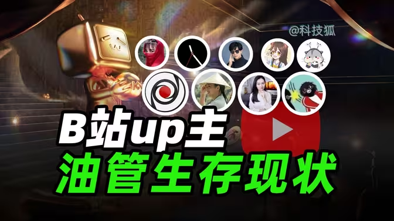
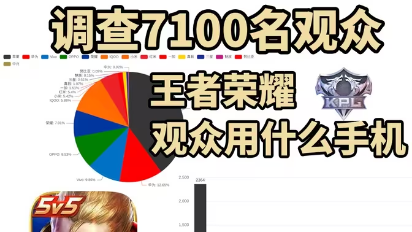
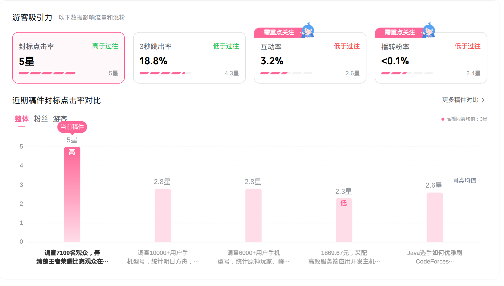

## Highlights

- 封面对小博主视频流量十分重要（百倍播放的差距）
- 做事最重要的是定义结束状态，结束状态可以随时改变，做事的过程中一直朝着结束状态前进

## Goal grades

每个月初，我都会设定自己想要完成的目标。以下是我完成这些目标的情况：

### 3 篇新概念英语精读、回译，英语语法入门第四章

- **Result**: 没有执行
- **Grade**: F

我对这个课程从内心有些恐惧，我也不知道为什么（可能是之前的语法课不能让我很专注地去听导致的），导致我一直没有勇气继续打开这套课程。

### 学习 Kdenlive，发布一个机型统计视频

- **Result**: 机型统计视频反响不错，在编辑这个视频的过程中学习了一些 Kdenlive 的使用
- **Grade**: B+

事实上使用 Linux 去制作视频并不是一个好的决定，中间遇到了几次崩溃，以及一些小问题。

使用剪辑软件去实现我脑海中的视频想法，这种感觉真的挺棒的。

在 B 站发布视频，封面对整个视频的影响非常大，这次我也是切实地体会到了。当我使用我的第一版封面时，视频的播放量不到 100。在我更换封面，重新上传之后，[视频的播放量目前是 5.4 万](https://www.bilibili.com/video/BV1xPv4BME6Y)。

我做的是一个统计类的视频，最初的封面我借鉴了我认为很好的一个封面，我认为这个封面传递信息做得很好，并且字体的色彩我认为也很不错。我做的基本上就是把背景换成了视频主题相关的，然后把文字改成了：“统计 XXX 人群的用机偏好”。

{{}}

发布之后，点击量很低。两天之后，播放量还没超过 200。我花了很多时间做的视频，并且之前已经经过验证了，播放量这么低我很不甘心。我发现我的封面确实很不好，作为一个统计视频，观众最关注的是数据相关的部分。

- 统计了多少人
- 统计的结果是什么

我的封面这两者都没有展示，观众自然没有点击的动力。我一直在用写作文的想法去做视频，想让观众去探索开始、高潮、尾声。但是事实是，如果你不把高潮放在视频封面，没人会点进来看的。

想到这一点之后，我把封面改成了这样。突出人数和统计结果。播放量开始上涨。

{{}}

{{}}

### 找到好玩儿的开源项目贡献 PR

- **Result**: 没有执行
- **Grade**: F

## 时间管理

在制作视频上花费的时间实在是太多了。我最开始想的很简单，统计几个不同分区的人群来重启我的统计系列视频。

后面我想到了一个有趣的话题，对比“支持”与“反对”毒品犯罪记录封存的用户机型差异（通过 AI 分析用户评论）。我最开始自己随便找了几个人去看了一下他们的机型，感觉结果会和我想的差不多。但是统计了 4000 多个人，支持封存的不到 100 人（还是去爬取支持封存的 KOL 的评论区），并且两个阵营的机型比例没什么区别。

最后月底快到了，我发现王者荣耀的比赛正在打。加上地域、性别分析，和我脑海里预想的一些分镜之后，时间刚好够一期短视频。

中间程序修改了很多次，因为最初只是玩票性质，所以没有很好地规划过，扩展的时候也是想到哪写到哪。但我大致想了一下，需求不是特别复杂，拆分也很简单，计划这个月去重写一下这个统计程序。

## Clair Obscur: Expedition 33 （剧透）

大学以来基本没怎么用心玩过单机游戏了，《双人成行》和《33 号远征队》是我唯二通关的单机游戏。

偶然刷到信息流看到这款游戏的背景故事，觉得很喜欢。这款游戏序章故事的展开很打动我：如果生命的期限已经注定，该如何度过最后的时光。

生命短暂，时光不复是文艺作品经久不衰的创作主题。小学的一次回家的路上，我骑着自行车，呼啸的风把路两边的树吹得张牙舞爪，我当时在想：明天的考试怎么办，如果我把今天的景象记录在脑海中，十年后的自己回忆起来是什么感觉？

随着游戏剧情的发展，发现制作者想讨论的问题是：如果这个世界是虚伪的、荒谬的，我们应该如何去选择呢？是否有勇气抛弃所有的羁绊退出呢？

剧情有点头轻脚重了，最后的部分解释了前面的所有，有点像推理小说，但是没有铺垫，突然出现了画中世界的概念。如果能多些铺垫我认为会更出色，或许确实有很多铺垫，只是我第一次玩没有意识到。

我玩的是普通难度，但是玩起来有点太简单了，根本不需要过分地去研究技能和符文。几十个天赋和灵光点的设定让游戏变得有点混乱了，至少在第一次玩是这样。

我相信如果二周目去玩这个游戏，应该会有比较好的体验。

## 如何做一件事情

把所有的事情分为三个问题：

1. 我要干什么？
2. 怎么干？
3. 任务怎么样才算结束？

最重要是定义什么算结束，结束的条件是可以随时变的。

要一直记得什么样算结束，这样可以让你一直往目标进发。有时候走得太远，忘了为什么出发。做事也是一样。

## Wrap up

### What got done?

- 一些简单的视频剪辑和视频工作流的实践
- 一期手机型号统计视频

### Lessons learned

- 结束状态对任务的执行是极关键的
- 视频封面对视频流量影响巨大，对于小博主可能是几百上千倍

### Goals for next month

- 重构 comment_user_analysis
- 争议话题的评论机型统计
- 制造英语环境，晚上回家之后尽量只接触英文内容
