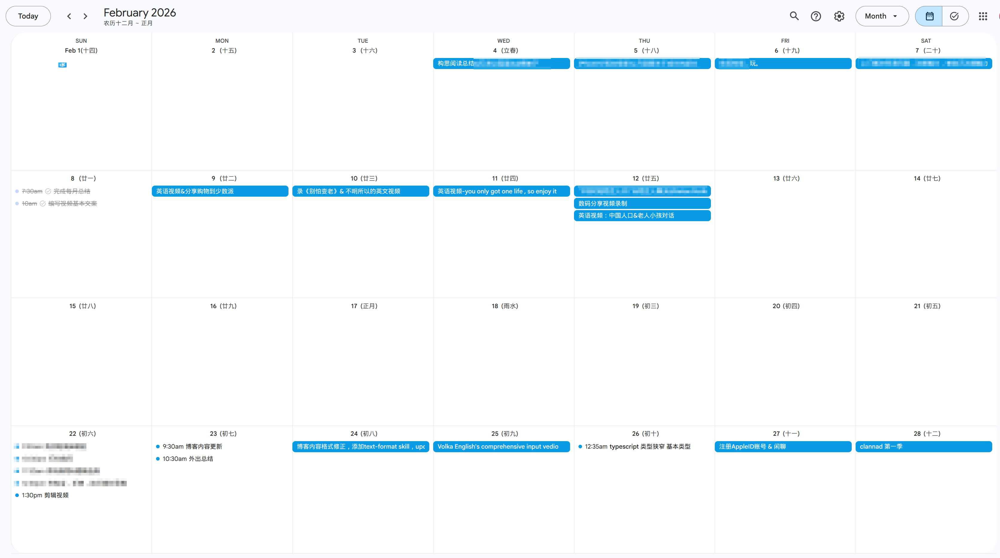

## Highlights

探索更多

## Goal grades

每个月初，我都会设定自己想要完成的目标。以下是我完成这些目标的情况：

### 构建可理解输入内容

- **Result**: 无
- **Grade**: D

我最开始的想法是通过大量观看平台随机推荐的英文视频，从而找到我感兴趣的内容，通过感兴趣的内容去学习，达到比较好的正反馈循环。

最终本月我只看了 80 分钟的纯英文视频，没有找到特别感兴趣的内容。 [Don't say I don't have time. It's I don't choose to do it or I choose to do it.](https://www.youtube.com/watch?v=t26iooY3PAo)

### 学习 React Native，做一个每日事务记录工具

- **Result**: 无
- **Grade**: D

最开始有这个想法，有两个原因

- 我对基于浏览器的应用的前景非常看好
- 尽管市面上有很多每日日程的记录工具，但是当时我就是想做一个给自己用

我发现最简单的 `Google Calendar` 就能把记录日程这件事情做得非常好。并且给 iPhone 开发应用需要 Mac 设备和 $99/年的费用，这让事情变得复杂了。

我当时定这个任务的时候只是基于上面的两点原因拍脑门决定的，没有任何关于产品的规划（界面、功能、目标……），所以导致启动这个任务很困难。

## 月度任务

自从我开始写月度总结以来，任务的完成度一直不是特别好，有 8 个任务的完成评分为 D（一共有 11 个任务），改善月度总结的任务相关内容是急迫的。

### 任务的可执行性

例如有两个任务，分别是 `观看 300 分钟的英文视频` 和 `构建英语的可理解输入内容`。本质上这两个任务是在干同一件事，但是前者的可执行性远高于后者。

任务不能是抽象的想法，任务需要是具体的目的。我统计了一下我很喜欢的一位博主 [Michael Lynch](https://mtlynch.io/) 最近五年的 [月度任务](./task-classified.txt)，被我统计到的 166 个任务中，大约 90% 的任务有明确的执行目的。例如 `获取 2000 个独立访客`、`增长 TinyPilot 项目的营收到 30000 美元`。

### 对复杂任务进行初步的规划

像这次的 `学习 React Native，做一个每日事务记录工具` 任务是有一个明确的目标的，但是这是个复杂的任务，包含了界面设计、功能构思、开发目标，对于一个复杂的任务，在制定的时候需要明确好一个初版的执行路径，能减轻执行前的心理负担。

之前的任务制定有好几个都是我在写月度总结的时候拍脑门制定的。但是我发现完成任务和制定任务都很重要。任务的制定也是很花费时间的，我认为在本月的学习过程中去记录想法，规划下个月要执行的任务是一个好的形式。

## 每日记录

在我的 [第一个月度总结](/retrospectives/2025/11/) 中，我就想写一下每天干了什么，但是一直以来的一直没有很连贯的执行。

这个月我发现 `Google Calendar` 这个简单的工具就可以胜任所有的需求（简单、方便、多端）。

{{}}

## 寻找陌生人聊天

或许是被 `Explore More` 影响，我越来越不抵触走出舒适圈。找陌生人聊天是我从来没尝试过的事情，这次过程中我找的人基本也多表示新奇。

我想去了解更多有血有肉的人，看看他们在干什么，他们在想什么，他们的生活方式是什么，他们有什么烦恼，他们有什么趣事。
当我确实感受到我不是这个世界的主角，其他人也不是 NPC，他们也是一个完整的有血有肉有思考的人，这个世界变得更宽敞了。

最开始我的想法是我做好准备，然后挑选一个日子去做。但是我想起我其他胎死腹中的任务，制定的时候也几乎都是抱着这种想法。

OK！准备好了不是一种感觉，它是一种决定。所以这次想法再次冒出来的当天我就去做了。

本次尝试总时长 2.5 小时，找了 8 个人聊天。

总体的体验还不错。回来总结的时候，我发现怎么去提问，如何让对方感到更加放松、自然是非常重要也是我需要去改进的点。

## 用积极的眼光去看别人

别人怎么看我并不重要，重要的是我认为别人在怎么看我。

如果我认为一切人都是善良的、积极的、乐于助人的，不管别人具体是怎么想的（也根本无法知道），那这个世界就是非常美好的，我们认识世界的方式不取决于世界是怎样的，而取决于我们怎么看它。

同时我们在积极的拥抱世界的时候，降低被世界拥抱的期待是重要的。

## Wrap up

### What got done?

### Lessons learned

### Goals for next month

- 观看 300 分钟的英文视频
- TypeScript
