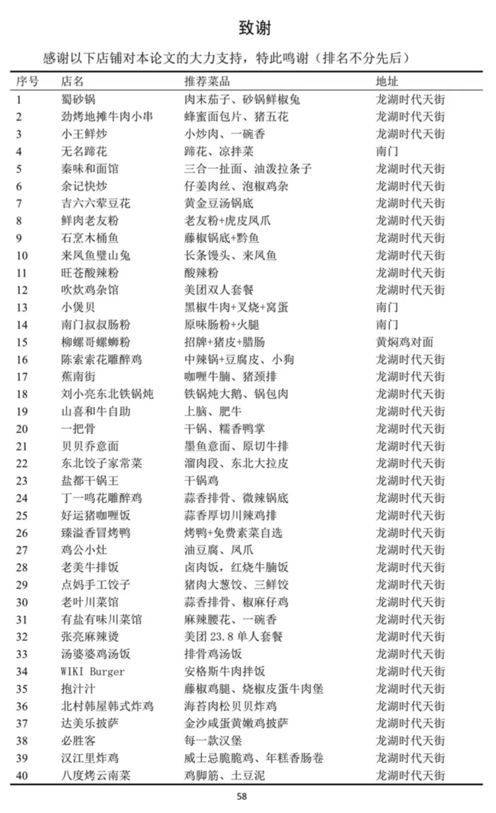
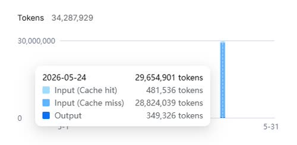
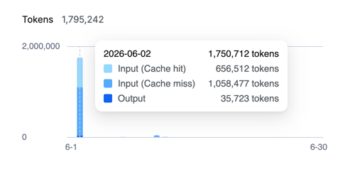
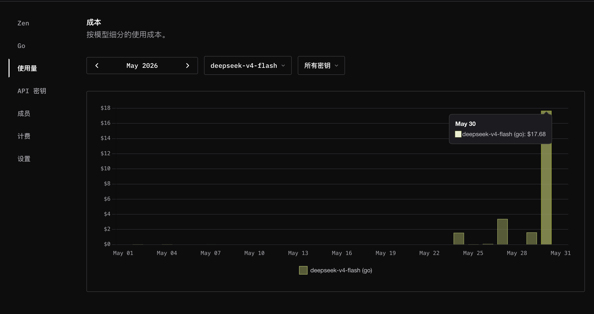
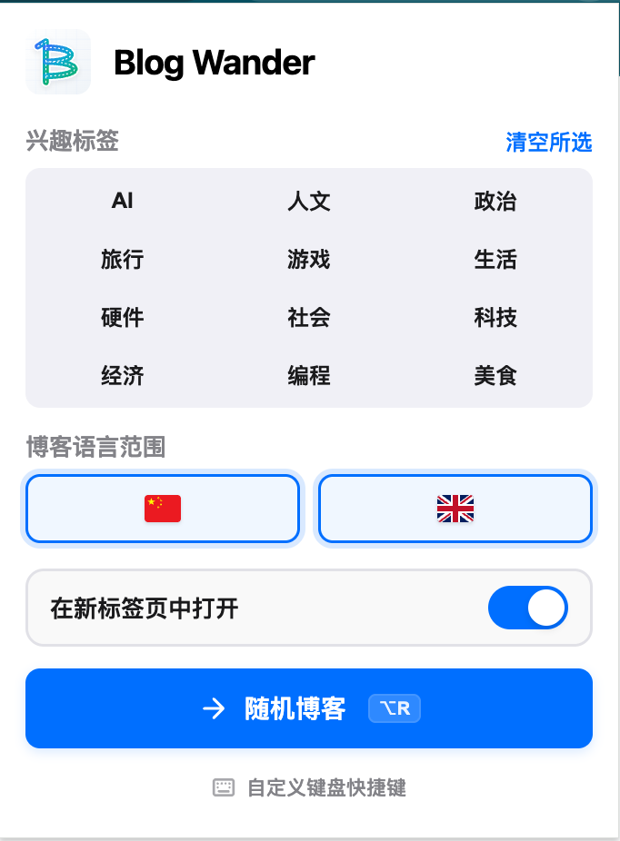

## 荷尔蒙

过去两个月情绪一直比较低落。我之前以为低落的来源是生活趋于稳定之后，新鲜感减少带来的空虚。

> 人生如钟摆，在痛苦和无聊中摆动，欲望得不到满足时就痛苦，欲望得到满足时就无聊

我是一个不懂吃的人。看到别人分享一长串的美食清单，我有时候就很纳闷，他们是对好吃的要求比较低，还是我太不会吃了。

{{}}

从小到大真让我感觉到「吃美了」的就只有一顿饭。

大二下学期，去哈尔滨参加比赛。因为是整个学习生涯的最后一场比赛了，准备了很久，想画下一个完美的句号。模拟训练的时候，成绩总是在拿奖的边缘徘徊。比赛之前的一个星期大家都很浮躁，我自认为是一个能坐得住的人，但是当时根本没法静下心训练，只想让这一切赶紧结束。

比赛挺顺利，最后拿到了满意的成绩，大概下午四点比赛结束。一整天就只吃了半个面包，结束的时候已经是饥肠辘辘了。

走出比赛场地，春末的阳光洒在肩头，微风让树叶飞舞，光与影在树下的红砖路上跑来跑去，一切都是那么的惬意。

傍晚和队友一起找了家餐厅，春末的气温刚刚好。坐在室外的座位，晚风搭配着烟火气。吃饭的过程中大家没有谈未来，没有谈过去，只是说今天的菜真好吃。我还记得最好吃的菜的名字叫「茶香梅肉」，我很怀念它。

最近又重新开始了健身。没有训练计划，没有饮食计划，也不追求有好的训练成果。最开始的目的就是把身上的劲使完，让晚上入睡更容易一点。

但是有一天锻炼之后，情绪突然特别好，脑袋里蹦出特别多的想法想要去实现。

事实上荷尔蒙才是身体的主人，大多数时候它是行动的直接原因。意识到这点之后，需要做的事情就很简单了，规律的运动和睡眠、健康的饮食、日光、社交。

简单但不容易。

负面情绪再次到来的时候，我知道我不需要专门地去解决它，我只需要继续地规律的运动和睡眠、健康的饮食、日光、社交，负面的情绪就会慢慢地消失。

之前看张朝阳关于「消极情绪」的看法，他是从行为心理学和脑科学的角度去分析的。核心观点是不要去处理糟糕的情绪，你越去处理，越会把糟糕的情绪进行放大，所以就不要去管，该干嘛就干嘛。

> 放大焦虑最好的方法就是解决焦虑

## Blog Wander 插件

我一直不怎么擅长读书籍，但是内容载体同样是文字的博客，我经常能连续读几个小时。

之前和同事聊天的时候，我经常会分享我看到的博客。有天同事问我：「有没有什么可以像知乎一样刷的博客？」

可以刷的博客，我觉得这个想法很好。

我先找了下相似的产品

- [Smallweb](https://github.com/kagisearch/smallweb)
- [开往](https://www.travellings.cn/)

Smallweb 做的确实不错，很符合我心中「可以刷的博客」的这个想法，但是只收录英文内容。

开往这个产品我不太看好。我自认为我是长期大量地阅读博客，但是我在这次调研之前，完全不知道「开往」这个产品。

### 谈谈「开往」的产品形态和用户体验

「开往」这个产品跳转的是博客首页而非内容页，也就是说这个产品更聚焦的是站点而非内容。

用户生态多为「内容创作者」，产品将内容创作者进行了连接。但是因为用户体验和产品本身的形态（站点分发而非内容分发），它没办法很好地连接内容和内容消费者。

用户体验为什么不好？

- 内容质量太差（优质内容创作者不会在博客上放上一个可能跳转到任意网站的链接）
- 推送的是网站首页，而非内容页，把筛选内容的成本转嫁给用户（直推内容 + 快速切换的模式从效率和体验上来说都更好）

### 开发过程

#### 收集 RSS 订阅链接，通过订阅链接去爬取博文

#### 通过 LLM 为文章打标签

对于一个没有推荐算法的内容分发平台，标签筛选是提升用户体验的关键。

打标签使用的是 `deepseek-v4-flash`，官方的 API 接口支持 2500 的并发请求，同时非思考模式的输出速度很快，非常合适用来做内容分类。

但是因为初来乍到，最开始使用 300 的并发去调用 LLM API，导致输入缓存的命中率很低。

{{}}
{{}}

#### 通过 LLM 为文章进行评分

博客的内容质量是产品的关键，但是很多博文不适合随机推荐。

有两类博文是非常不应该推荐的

- 前 AI 时代的初级技术教程
- 算法题解

我的做法是预先定义一组标签，并为每个标签设置对应的加减分值。AI 分析文章后输出匹配标签，程序再根据这些标签及其分值计算出文章的最终得分。

月初买的 OpenCode Go 套餐，但是体验下来国产模型（2026-05）的和顶尖闭源模型有比较大的差距，买了之后没怎么用，额度还剩了很多。就直接使用了 OpenCode 的 API 跑了文章评分，但是 OpenCode Go 套餐的并发支持得很低，大概是 5 ~ 8，跑了 12 个小时才把评分跑完。

{{}}

#### API 部署

技术方案是：Cloudflare D1 进行数据储存，Cloudflare Worker 负责业务逻辑

### 最终产品

[Chrome 安装 Blog Wander](https://chromewebstore.google.com/detail/blog-wander/dignlbmfodpdafnepgjlcfhliomplgfl)

[Edge 安装 Blog Wander](https://microsoftedge.microsoft.com/addons/detail/blog-wander/iijoledolemeajknliccffdolfheoibf)

{{}}

## Wrap up

### What got done

- 情绪管理，如何成为情绪的主人
- Blog Wander 插件制作
- 生活习惯的养成（作息、锻炼）

### Lessons learned

- 放大焦虑最好的方式是解决焦虑。所以无视焦虑，做该做的事
- 调用 LLM API 时并发过高会导致 Input Cache 率很低
- 获取信息、整理信息、思考信息 & 延迟满足

### Goals for next month

- 推广 Blog Wander 插件
- 「实体产品」项目的开发、推广、销售
