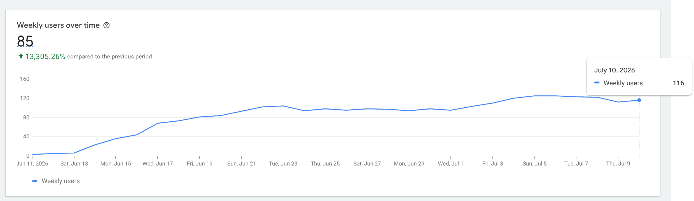
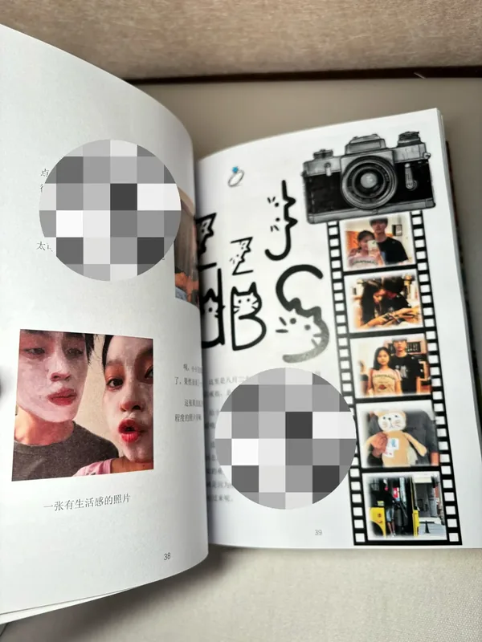

## Highlights

- 获得 100 个用户
- 内容要和容器相匹配
- 尝试做一款游戏

## Goal grades

每个月初，我都会设定自己想要完成的目标。以下是我完成这些目标的情况：

### 推广 Blog Wander 插件

- **Result**：当前总用户数 116 人
- **Grade**：B+

通过论坛发文章、投稿咨询收集平台、用户自发推荐、寻找有影响力的博主进行推广，最终获得了 100 个用户。这是我第一个有用户的产品，感觉还是不错的。受限于整个中文博客的生态，后续应该只会进行清除不合适的订阅源、定期的更新博客文章这种维护性的工作。

{{}}

### 「实体产品」项目的开发、推广、销售

- **Result**：完成了工具的制作和产品的推广，未联系到销售
- **Grade**：C

推广商品比我想象中的难。在抖音和小红书上发布作品，主动联系了大概 10 人。因为整个过程中没有反馈，并且最开始预期不高，就去做其他的事情了。



## 聊天热力图产品

关于聊天热力图产品项目，因为整个产品非常容易复制，所以最开始就没有抱太高的期待。之所以做是因为我认为这个点子很好，想让更多人享受这份礼物所带来的喜悦。

因为具象化抽象的东西一直是很受欢迎的。拍立得是把美好的回忆实体化、各种运动监测、睡眠监测的产品层出不穷，这些产品是把本虚无缥缈指标可视化。实体化回忆，我认为是很有意义的。

但是我有点低估推广的难度了，我不知道如何推广一个实体产品，也没见过别人做实体物品推广的全流程。现在来看有一个让我惊讶的点：我的推广作品竟然全部都是图文。后面如果有时间我应该会做一条视频推广的帖子。

在主动去找有需求的人时，发现礼物推广的竞争还蛮激烈的，每一个咨询送礼物的帖子下面都有十几二十条的广告。

抛去创作者的滤镜来看这个产品，有很多的不足之处，所以就算推广有流量，转化率也不会太高。

1. 承载回忆的物品不够精致

   整个产品看起来不够精致，人物头像比较模糊，其他的部分也有模糊的感觉。并且这带来了一个问题，这样一个不精致、物料制作成本很低的产品无法承载高价值的回忆（手动数聊天记录所花费的时间）。喝红酒要用高脚杯，喝茶要用紫砂壶大概就是这个道理吧。

2. 聊天记录是需要手动数

   这点大多数人无法接受。我最初的想法是虽然这会让转化较低，但是因为用户需要付出较高的时间成本，所以产品的价值会得到提升，可以卖更贵的价格。因为我本身网上聊天比较少，所以即便是关系好的朋友，一年的聊天记录基本上两三个小时就能处理完毕。但是我预想这款产品面向的最主流的消费者是高中生和大学生，他们是活力最充沛的群体，两个人一年的聊天记录动辄上万条，让他们去数聊天记录的可行性太低了。

3. 心意与新意

   我是一个喜欢形式上新的东西的人。我和一个朋友说到这个想法的时候，她问我：「你这个东西和手账本怎么竞争？」确实，手账本从可自定义的程度、承载回忆信息的能力、最终产品的客观质量、解释成本都要比我的产品要好。但是我个人喜欢形式上新的东西，我把新意当作心意的一种体现。

{{}}

我还是挺喜欢我做的这个东西的，虽然上面说了很多的不足，但是现在我依然认为这是一个好的产品，但是不可否认的是好的产品不一定是好的商品。

## 聊天播客

之前一直想做一个播客，本身我是一个很喜欢聊天的人，并且我享受聊天的过程，所以希望可以把这个过程记录下来，当作一个存档也是不错的。

正好这个月有个契机，把和朋友的聊天视频录制了下来，上传到了 B 站。出乎我意料的一点是，当我回看聊天视频的时候，一点尴尬的感觉都没有（我看自己的东西时常会觉得尴尬），感觉两个人聊天还不错。

我使用 Google Lyria 生成视频的 intro 音乐，真的是给我惊喜了，我非常喜欢。

<audio controls preload="none" src="intro-music.mp3" style="display: block; margin: 0 auto;"></audio>

## 游戏制作

最近在做各种各样东西的过程中，发现我有三个在意的东西。

- 我是否认同这件事（有时候做到一定程度，发现和自己最开始的想法完全不同）
- 能不能为用户提供价值
- 收获反馈

但是想找到这样的事并不容易。游戏就恰好满足这三点：

- 我认同做游戏这件事，我认为这是在创造一个新的东西，并且我现在有一个不错的想法
- 游戏可以给玩家提供乐趣、消磨时间
- 如果一直记录整个开发的过程，发布出来。我相信会收获一批观众和玩家

所以未来的一段时间，我会花大量的时间玩游戏、思考游戏、做游戏。未来一段时间的月度回顾的标题可能是：Game Product: Month X

而且游戏有一个先天的优势：其他的产品都需要去找用户，但是游戏不需要，几乎所有人都是游戏玩家。虽然做出来的游戏不一定每个人都喜欢玩，但是至少每个人都能看的懂。

## Wrap up

### What got done?

- 发布了 Blog Wander 插件
- 制作亚克力聊天热力图产品
- 尝试 NixOS 系统，学习 Nix 语言

### Lessons learned

- 推广产品是不容易的，持续的在熟悉的领域积累影响力是关键的（虽然听起来不太性感）
- 内容要和容器相匹配（喝红酒需要高脚杯，喝茶需要紫砂壶）
- 内网的一些内容聚合平台的流量很可观（Blog Wander 被一个内容聚合平台推荐了，收获了一波流量）

### Goals for next month

- 杀戮尖塔通关
- 写一篇游戏分析的 Post
