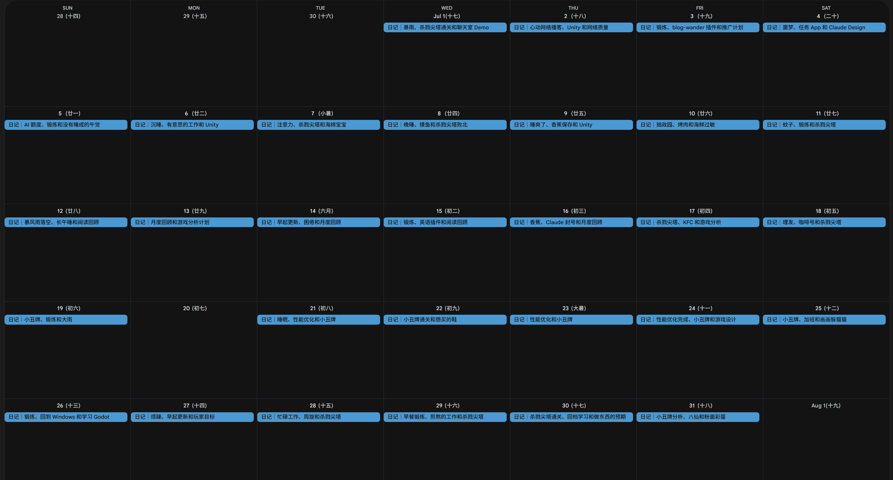

## Highlights

- 摘下镣铐跳舞

## Goal grades

每个月初，我都会设定自己想要完成的目标。以下是我完成这些目标的情况：

### 杀戮尖塔通关

- **Result**：四角色通过第三幕、战士通过第四幕
- **Grade**：B

游戏很久之前就买了，因为前期的探索有些无聊，并且不知道在哪听说一局有 20 幕，所以就没有继续玩了。要是早知道只有 3 幕，可能当时就通关了。这样来看，一个垫垫脚就能够到的目标还是很重要的。

一些浅显的理解：

1. 拥有足够的攻击力
2. 拥有足够的防御
3. 增加抽中核心卡牌的概率（精简牌池、以及适配的抽卡牌）
4. 针对 Boss 的机制拿牌

我玩这款游戏最大的爽点是：察觉到卡牌之间的联动方案与验证猜想的过程

### 写一篇游戏分析的文章

- **Result**：[小丑牌游戏分析](https://lixiucheng.com/game-reports/balatro/)
- **Grade**：B

最开始我是打算去分析《杀戮尖塔》的，但是游玩的过程中，感觉这个游戏的内容很多。角色机制和卡牌的设计、遗物设计，然后玩法的系统设计等等等等，对我来说非常庞大。上来就搞一个这么大的东西，不是一个特别明智的选择。

所以最终我选择了本月玩的第二款游戏《小丑牌》。这款游戏我刚上手就玩得非常爽，并且游戏整体的体量也不大，我感觉这是我开启分析游戏的一个好的开始。

内容写的并不是很多，大概有 1500 字。可能我真的去做一款游戏的时候，才会意识到它设计的精妙之处。

## 游戏制作

在玩《小丑牌》的时候，我也想到了一个我自己的游戏开发方向。我打算做一款小丑牌 + 俄罗斯 1010 的缝合游戏。本月的开发任务分为这几个阶段：

1. 最简陋版本的制作（只包含核心玩法的游戏循环）
2. 添加基础方块摆放音效、动画
3. 核心的数值膨胀玩法（分数计算机制、卡牌机制）
4. 商城玩法添加
5. 模仿小丑牌的主流程设计

待定：方块生成（不确定当前的随机生成是否能满足游戏体验）

## 关于规则

我很擅长遵守规则（无论规则有多么离谱）。

我认为按照游戏制作者的意图去游玩游戏是正确的，所以之前的我完全不会 Save-Load（在关键节点先存档，输了就读档重来）。或许也是担心被别人说是走捷径，虽然没人看我玩游戏，也没有人评判我，但是我心中似乎有一个朴素的世俗价值观小人无时无刻不在对我自己的举动进行评价。

但是 Save-Load 不会损害任何人的利益，并且能提升我玩游戏的乐趣，完全没有理由为了遵守游戏规则不做这件事。

并且 Save-Load 重复玩一个关卡更能理解游戏。游玩的过程中大多数情况下只是根据游戏的即时反馈，给出我的即时反应，中间没有思考，游戏水平只是简单的经验堆砌。但是当 Save-Load 反复去挑战 Boss 关卡的时候，总结经验变得非常容易。

有一次和朋友一起逛超市，我们什么也没买，打算出去。当时有两个选择，第一个是跨过护栏出去，第二个是绕一大圈，最后到达同样的位置。两种选择不会给别人带来任何损失，结果也完全一致。但是我当时就是选择了后者。后来回想起这件事的时候我都很惊讶，我意识到我对规则的遵守有些过于偏执了。

我一直跟别人说「不要在意别人的看法」，其实我内心中住了一个「别人」。

## Wrap up

### What got done?

- Unity 和 Godot 游戏框架入门
- 体验游戏（小丑牌和杀戮尖塔）
- 写第一篇游戏分析文章

  {{}}

### Lessons learned

- 摘下镣铐跳舞

### Goals for next month

- 代号 TB 的 V0.1 完结
- Go 语言学习与思维题（使用 Go 语言写一些思维题，每道题思考时间不超过 20 分钟）
