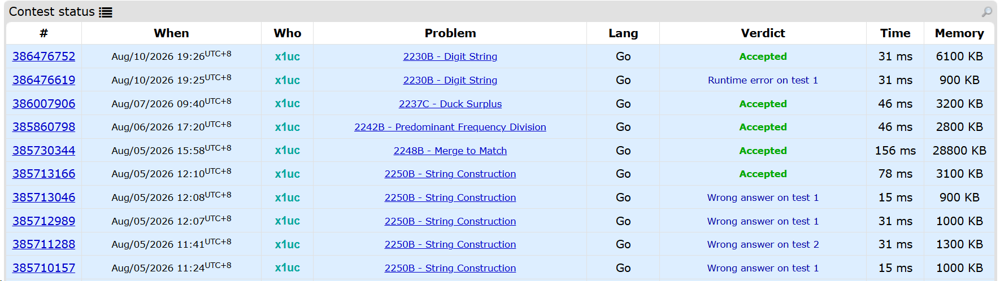

## Highlights

- 销售的核心是什么？
- 简单是传播的关键

## Goal grades

每个月初，我都会设定自己想要完成的目标。以下是我完成这些目标的情况：

### 代号 TB 的 V0.1 完结

- **Result**：完成了基本玩法的部分
- **Grade**：B-

完成了游戏基本玩法的搭建。但是主要的循环（关卡 → 商城 → Boss 关 → 商城 → 关卡）没有完成。

如何生成方块的是这个游戏好玩与否的关键，但是我这个月把时间主要投入在了游戏的架构搭建。下个月的重点我会放在把生成方块的逻辑做好，让游戏变得好玩。



### Go 语言学习与思维题

- **Result**：5 道思维题
- **Grade**：B-

月初的时候写了 5 道题目，因为本身制定的时候就没当成一个目标明确的计划，后续随着其他任务的出现也就把这项搁置了。

写思维题本身还是蛮有意思的，猜想 → 实现 → 验证整个流程还是挺舒服的。

{{}}

## Sell Me This Pen

我现在经常面对铺天盖地的信息感到不知所措，所有的视频／文章都不一样，但是好像所有的视频／文章又都一样。封面、标题、内容仿佛从流水线生产出来一样，但是如果你想在这场游戏里获得什么，那就必须这样做。我也没有权力指责任何人，[我自己的视频](https://lixiucheng.com/retrospectives/2025/12/#%E5%AD%A6%E4%B9%A0-kdenlive%E5%8F%91%E5%B8%83%E4%B8%80%E4%B8%AA%E6%9C%BA%E5%9E%8B%E7%BB%9F%E8%AE%A1%E8%A7%86%E9%A2%91) 也用过这种方法。

但是当同质化达到一定地步的时候，整个事情会变得无聊。

推荐流的模式让我感觉每个视频都想给我投送信息，教我做好 A、B、C。但是我更喜欢的方式是人和人的连接，在世界的某个角落的素未谋面的人，Ta 最近在做什么，Ta 有什么喜欢的东西，Ta 最近在面临什么烦恼，以及 Ta 是如何思考的。视频同样能传达信息，但是我认为写作能最大程度地调用思考，对作者和读者都是。

> 受限于整个中文博客的生态，后续应该只会进行清除不合适的订阅源、定期的更新博客文章这种维护性的工作。

这是我刚制作 [Blog Wander](https://lixiucheng.com/retrospectives/2026/06/#%E6%8E%A8%E5%B9%BF-blog-wander-%E6%8F%92%E4%BB%B6) 插件的时候对它的看法。我当时认为中文市场的博客阅读的需求很小，所以没有什么增长的潜力，就没有继续做了

Blog Wander 插件可以提供博客的阅读，但是喜欢在网页端阅读文字的人太少了，所以我不打算继续了。这是我当时的想法

但是我为什么喜欢读博客呢？是因为我很喜欢在网页端上阅读嘛？我想最关键的点是每个博客的背后都是一个人，我喜欢人与人之间的连接。当我通过搜索引擎发现一个博客，在解决问题之余我喜欢看下这个人其他的文章，他是谁，他在干什么，他的思考方式，他喜欢什么，他在读什么，他引用了哪些其他的人。

这样来看，Blog Wander 不是连接人和文章，而是连接人和人、人和思想。所以中国阅读博客的人很少不是问题。Blog Wander 提供的不是像 Bilibili、抖音这样中心化的内容平台，而是一个可以网状探索互联网的空间。我们面向的不是阅读博客的人，而是喜欢探索网络空间、喜欢和其他人之间建立连接的人。

> A：我们一起来探索网络世界吧，看看其他人的思考方式、喜好、生活

> B：很有趣，但是去哪探索呢？

> A：[Blog Wander](https://chromewebstore.google.com/detail/blog-wander/dignlbmfodpdafnepgjlcfhliomplgfl)



## Blog Dice

最开始的时候，因为 Blog Wander 的内容较少，所以我就想着去借助 AI 去翻译一批外国优质的 Blogger 的文章去增加内容，相当于直接为网站添加了 100 位顶尖的 Blogger。

于是就有了 [Blog Dice](https://blogdice.com/zh)这个网站，这个网站通过 RSS 定时的去同步原作者的文章并自动翻译。

我想后面如果网站的流量如果有起色，开设一个硬件文章的分区，然后把文中的购买链接旁添加上更符合读者当地购物习惯的平台的广告联盟链接（例如：在作者留下的购买链接旁，放上同款商品的淘宝链接），或许是一个不错的主意。

## AI 生成视频

大学的时候和同学们一起拍过一个小短片，拍的时候感觉挺有意思的。本来打算把视频放出来的，但是年代太久远，手上已经没有这个视频的拷贝了。

有阵子[马保国的一个视频](https://www.bilibili.com/video/BV1584y1N7cR)特别火。当时我感觉他讲的话很有故事性，可以拍出来。我的想法是用马保国的声音当解说，然后演一场默剧。但是还没等我开始拍，[这个话题就被封禁了](https://news.cctv.com/2020/11/28/ARTIvtLJ2qbA8e2yfbflcoXa201128.shtml)。

最近 AI 视频生成的能力貌似很强，所以就借着这个机会实现了我一直以来的想法。



因为是以默剧的形式呈现的，所以导致很多的镜头没办法拍摄，我很难让马老师在不用嘴的情况下向观众解释什么是「化劲」。所以最终的视频从原视频的 2:47 变成了 00:53。

## 关于简单

发现了一个在论坛上开启热点话题的窍门：「问一个回答起来很简单的问题」。

最开始我是看到了一条 tweet，作者讲了下对四季颜色的看法，然后提出了一个荒唐但是简单的问题。虽然问题不怎么高明，但是回帖量很多。我看了下回帖的内容，大家根本没在意作者荒唐的推断，而是把所有的注意力都放在了作者最后问出的那个简单的问题上。

注意到这点之后，我把一个简单的问题：「你眼中的夏天是什么颜色？」放在了 V2EX 论坛上。获得了 78 条回复。

今天把我写的[《上学累还是上班累 | 三低问题实录》](https://lixiucheng.com/3d-question-01/)发送到 V2EX 上，附上问题：「上班累还是上学累？」，获得了 81 条回复。

当然这可能也和 V2EX 论坛本身的属性有关，论坛上供人消遣的内容比较少，所以随便来一个有互动性的话题就能带来大量的互动。

## 喜欢

喜欢这个东西来的总是莫名奇妙，我还总是喜欢为喜欢找一个理由，但是其实为”喜欢“找理由常常是先射箭再画靶。

我很喜欢 Go 语言，我在月度回顾中应该提到过很多次，我也不知道为什么喜欢，如果现在画靶子的话，大概是因为：好用的包管理工具、简单直接的语法、卓越的性能。哈哈哈，发现原因根本数不过来，很难说是先喜欢 Go 语言的还是先喜欢这些特性的。

既然我这么喜欢，那就完全没理由再坐视不管了，正好最近对 AI Agent 也很有兴趣，所以打算借助一个[Go 的 Agent 项目](https://github.com/charmbracelet/crush)这个月真的认真学习一下 Go

正好给自己布置两个任务：

1. 工程方面：如何接入各个模型的厂商
2. Agent方面： LLM 是如何调用工具（EDIT、BASH、WRITE）的，以及工具的实现方式

## Wrap up

### What got done?

- 代号TB V1.0 基本框架
- 浅尝 AI 生成视频
- Blog Dice 的搭建

### Lessons learned

- 销售的关键不在于产品有多好，而是满足用户的需求，并且需求是可以被创造的
- 简单有利于传播
- 通过 Supabase 接入 OAuth 登录
- AI 视频生成，起始帧参照是个重要的功能

### Goals for next month

- 入门 Crush Agent 工具，发布两篇相关的 Blog
